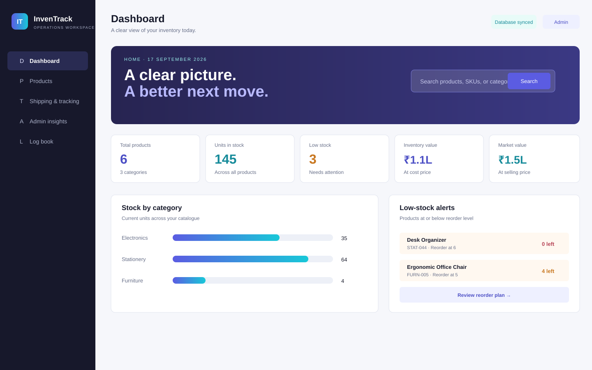
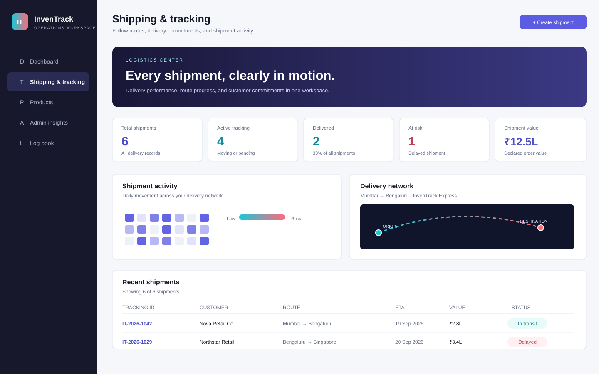

# InvenTrack - Inventory Management & Operational Intelligence System

[](#project-specification)
[](#project-specification)
[](#system-architecture--core-modules)
[](#system-architecture--core-modules)
[](#key-features--capabilities)

**InvenTrack** is a modern inventory management and operational intelligence web application built for small businesses, suppliers, distributors, and academic demonstration. It helps a company manage products, stock movements, suppliers, reorder planning, market value, inventory value, and operational activity from one clean dashboard.

The project is a full-stack single-page application. The frontend is built with HTML, CSS, and JavaScript, while the backend is a Node.js server connected to a local SQLite database. Inventory data is saved in `data/inventrack.db`, and the browser keeps only workspace preferences and an offline backup.

The dashboard includes role-based workspaces for administrators, suppliers, distributors, retailers, and wholesalers. It also includes charts, business statistics, a sales-region globe, a log book, and a local data-aware chatbot for asking inventory questions.

**Live portfolio demo:** [Open InvenTrack](https://inventrack-portfolio.gshivanshu007.chatgpt.site) · **Release:** `v2.5.0`

For the path from MCA submission to a paid pilot, follow the [production checklist](docs/PRODUCTION_CHECKLIST.md) and [launch guide](LAUNCH.md).

## Quick Start

Run the complete website locally:

```bash
node server.js
```

Then open:

```text
http://localhost:3000
```

Run backend checks:

```bash
node tests/backend.cjs
```

See [LAUNCH.md](LAUNCH.md) for domain hosting, deployment, database notes, and the remaining work needed before selling it as a live customer subscription product.

---

## Table of Contents

0. [Interface Previews](#interface-previews)
1. [Project Specification](#project-specification)
2. [Problem Statement & Objectives](#problem-statement--objectives)
3. [System Architecture & Core Modules](#system-architecture--core-modules)
4. [Data Model & Persistence Schema](#data-model--persistence-schema)
5. [Key Features & Capabilities](#key-features--capabilities)
6. [Changelog & Chronological Development](#changelog--chronological-development)
7. [Validation & Business Logic](#validation--business-logic)
8. [Local Execution & Debugging](#local-execution--debugging)
9. [Deployment Notes](#deployment-notes)
10. [Python Reporting Utility](#python-reporting-utility)
11. [Repository Structure](#repository-structure)
12. [Quality Assurance & Test Scenarios](#quality-assurance--test-scenarios)
13. [Limitations & Future Roadmap](#limitations--future-roadmap)

For a short presentation script, see [docs/PORTFOLIO.md](docs/PORTFOLIO.md). For the technical data flow, see [docs/ARCHITECTURE.md](docs/ARCHITECTURE.md).

---

## Interface Previews

The repository includes readable, scalable previews of the two main portfolio flows:





These previews are useful on GitHub when the live demo is sleeping or unavailable. The deployed demo remains the best place to interact with the seeded inventory and shipment workflows.

---

## Project Specification

| Attribute | Specification |
| :--- | :--- |
| **Programme** | Master of Computer Applications (MCA) |
| **Course Component** | Academic Mini Project |
| **Domain** | Inventory Management & Enterprise Information Systems |
| **Version** | `2.5.0` (Production Readiness Release) |
| **Academic Year** | 2026 |
| **Persistence** | SQLite core database with `localStorage` used only as an offline browser backup and workspace preference store |
| **Target Platforms** | Modern Chromium, Gecko, and WebKit Browsers (Desktop, Tablet, Mobile) |

---

## Problem Statement & Objectives

### The Problem
Traditional small-to-medium inventory management frequently relies on manual paper ledgers or fragmented spreadsheets. These legacy approaches suffer from:
* **Human Data Entry Errors:** Accidental duplicate SKU creation and incorrect unit math.
* **Negative Stock / Overdrafts:** Lack of transactional guards allowing stock-outs that exceed physical stock on hand.
* **Delayed Reordering:** Lack of automated replenishment alerts leading to out-of-stock downtime and lost sales.
* **Opaque Audit Trails:** Inability to trace who adjusted stock, when, and under what reference order.

### Project Objectives
* **Structured Catalogue:** Centralize product records with guaranteed case-insensitive SKU uniqueness.
* **Audited Stock Movements:** Record `IN`, `OUT`, and `ADJUSTMENT` transactions with automated running balance computation and strict availability checks.
* **Supplier-Product Traceability:** Connect every stock item with a primary supplier entity.
* **Automated Financial Intelligence:** Dynamically compute stock valuation in Indian Rupees (₹), gross profit margins, and reorder budgets.
* **Data Portability:** Provide dual-direction RFC 4180-compliant CSV import and export workflows.
* **Role-Based Workspace Context:** Customize operational experiences for Retailers, Wholesalers, and Administrators with a persistent activity log.

---

## System Architecture & Core Modules

InvenTrack is a **full-stack Single-Page Application (SPA)**. Node.js serves the browser client and a JSON API; SQLite persists the shared inventory catalogue, suppliers, and movement ledger.

```text
+-------------------------------------------------------------------------+
|                        Presentation Layer (HTML5/CSS3)                  |
|  - Responsive CSS Grid & Flexbox   - Semantic Modals (<dialog>)         |
|  - Dark / Light Theme Engine        - Low-Stock Notification Center      |
+------------------------------------+------------------------------------+
                                     |
+------------------------------------+------------------------------------+
|                   Business Logic & State Controller (ES6+)              |
|  - Hash-based Routing Engine       - Product & Stock Calculation Engine |
|  - Transactional Guard (Stock-out) - Case-Insensitive SKU Validator     |
|  - Activity Audit Logger           - RFC 4180 CSV Import/Export Parser  |
+------------------------------------+------------------------------------+
                                     |
+------------------------------------+------------------------------------+
|                      API & Persistence Layer (Node.js + SQLite)         |
|  - `/api/inventory`                - `data/inventrack.db`               |
|    (Suppliers, Products, Ledger)      (SQLite relational database)       |
+-------------------------------------------------------------------------+
```

### Core Application Modules

1. **Executive Dashboard (`#dashboard`):** Real-time key performance indicators (Total Products, Units, Low-Stock Count, Inventory Valuation at cost, Gross Margin Potential), category distribution bar chart, fast alerts, and recent movement history.
2. **Product Catalogue (`#products`):** Full CRUD catalogue management with multi-field search (Name, SKU, Category), category dropdown filter, and stock-status filter (Healthy, Low Stock, Out of Stock).
3. **Reorder Planning Engine (`#reorder`):** Automated procurement analysis identifying all items at or below reorder threshold, calculating suggested order quantities and supplier-specific cost projections.
4. **Stock Movement Ledger (`#movements`):** Immutable audit ledger recording every inventory adjustment, incoming supplier delivery, or customer dispatch with references, notes, timestamps, and updated balances.
5. **Supplier Directory (`#suppliers`):** Image-backed partner profiles, linked product counters, portfolio share, route activity, and direct communication links (`tel:`, `mailto:`).
6. **Shipping & Tracking Center (`#logistics`):** Shipment KPIs, delivery status filters, activity heatmap, route map, tracking event timeline, ETA visibility, and a create/advance shipment workflow.
7. **Audit Log Book (`#logbook`):** Central operational timeline recording user interactions, data mutations, and workspace configuration changes with role context.
8. **Project Documentation & Demo Reset (`#about`):** Overview of academic goals, technology stack, entity relationship diagrams, and an instant demo-data reset mechanism for presentations.

---

## Data Model & Persistence Schema

The data layer models an operational supply chain using normalized entity relations:

```text
  +------------------+         1 : N         +------------------+
  |     Supplier     | --------------------> |     Product      |
  |------------------|                       |------------------|
  | id (PK)          |                       | id (PK)          |
  | name             |                       | name             |
  | contact          |                       | sku (Unique)     |
  | phone            |                       | category         |
  | email            |                       | quantity         |
  | address          |                       | reorder          |
  +------------------+                       | cost             |
                                             | price            |
                                             | supplierId (FK)  |
                                             +------------------+
                                                       |
                                                       | 1 : N
                                                       v
                                             +------------------+
                                             |  Stock Movement  |
                                             |------------------|
                                             | id (PK)          |
                                             | productId (FK)   |
                                             | type (in/out/adj)|
                                             | quantity         |
                                             | balance          |
                                             | reference        |
                                             | notes            |
                                             | date (ISO 8601)  |
                                             +------------------+
```

### Storage Schema Definitions

#### 1. Core Database (`data/inventrack.db`)
* **`suppliers`**: SQLite supplier table with the supplier contact fields.
* **`products`**: SQLite product table with a case-insensitive unique SKU and optional supplier foreign key.
* **`movements`**: SQLite movement ledger table storing stock-in, stock-out, and adjustments.
* **`sales_regions`**: Geographic sales destinations used by the executive globe.
* **`shipments`**: Shipment records with tracking IDs, route coordinates, carrier, status, value, weight, and ETA.
* **`shipment_events`**: Chronological delivery milestones linked to each shipment.
* **`visitor_events`**: Privacy-friendly visitor IDs deduplicated once per day; no IP addresses or personal data are stored.
* **API**: `GET /api/inventory` loads all collections; `PUT /api/inventory` saves them atomically in a SQLite transaction; `POST /api/visits` records a daily unique visitor and returns the visitor pulse.

#### 2. Workspace Database (`localStorage['inventrack_workspace_v1']`)
* **`role`**: `'retailer' | 'wholesaler' | 'admin'`
* **`theme`**: `'light' | 'dark'`
* **`activity`**: `Array<{ id: string, action: string, detail: string, date: string, role: string }>` (bounded to 100 most recent events)

---

## Key Features & Capabilities

* **Role-Based Profiles:** Tailored setup modal and header indicator for Retailers (sales/fast-moving focus), Wholesalers (bulk orders & replenishment), and Administrators (system audit and configuration).
* **Live Role Switcher:** Quick-access topbar chip enabling seamless switching between operational profiles without data reset.
* **Low-Stock Notification Center:** Interactive bell icon with dynamic badge count displaying real-time alert items requiring immediate procurement attention, featuring click-outside auto-dismissal.
* **Dark / Light Theme Engine:** Persisted visual styling with high-contrast color variables conforming to modern accessibility standards.
* **Executive Dashboard:** Clean professional dashboard with inventory value, market value, supplier/distributor summaries, stock readiness, and readable business charts.
* **Visitor Pulse:** Admin insights summary card showing total unique visitors, today’s count, and the seven-day visitor pulse from the SQLite backend.
* **3D Distribution Intelligence:** A true WebGL Earth mesh with geographic texture, drag rotation, tilt, scroll zoom, reset controls, country labels, sales territories, shipment routes, status markers, route counts, growth signals, and regional business context.
* **Product Portfolio View:** Visual catalogue cards backed by generated product imagery, stock status, market value, margin rate, supplier link, and detail actions.
* **Shipping & Tracking Center:** Database-backed shipment records with delivery KPIs, status filters, activity heatmap, route map, tracking history, ETA visibility, and a create-shipment workflow.
* **Local Inventory Assistant:** Built-in chatbot that answers inventory questions from the current database without sending stock data to a third-party AI service.
* **Dual-Direction CSV Engine:**
  * **Export:** One-click CSV generation capturing full catalogue records, computed valuations, margins, and supplier names.
  * **Import:** Client-side CSV parser supporting RFC 4180 quoting, header validation, duplicate SKU detection, and auto-generated opening stock audit records.
* **Defensive Input Handling:** Built-in HTML character escaping to safeguard against Cross-Site Scripting (XSS) during dynamic DOM rendering.

---

## Changelog & Chronological Development

### Latest Project Update - September 17, 2026

The project was upgraded into a more complete full-stack management dashboard. The latest version includes a professional midnight-indigo interface with cyan and coral accents, larger readable labels, solid dashboard panels, sharp charts, visible database status, safer backend saving, SQLite WAL mode, and restricted static-file serving.

The distribution globe now uses a real WebGL-rendered Earth mesh with an equirectangular texture, depth-tested lighting, drag rotation, tilt, scroll zoom, and reset/zoom controls. Country labels, territory arcs, shipment routes, route markers, growth signals, and regional order context sit above the model. The Product Portfolio adds visual catalogue cards with stock value and margin detail, while Supplier Network adds partner portraits, portfolio share, route activity, and risk context. The new Logistics Center adds shipment KPIs, status filters, a delivery activity heatmap, a route map, tracking history, ETA visibility, status progression, and database-backed shipment events. The Admin insights view now includes a privacy-friendly visitor pulse with daily de-duplication and a static-demo fallback. Runtime API-origin configuration, controlled CORS, environment templates, and a commercial production checklist are included for the next deployment stage. The Log book now shows database-backed product release notes, and the backend can be checked with:

```bash
node tests/backend.cjs
```

This project was developed incrementally through continuous feature additions, performance refinements, and code quality audits:

```text
2026-08-20          2026-08-25          2026-09-03          2026-09-07          2026-09-09
    |                              |                            |                               |
    *------------------------------*----------------------------*-------------------------------*
Initial Prototype      Workflow Overhaul      CSV Import & Tooling      Workspace Redesign      Backend & Database
- Core SPA structure     - Rebuilt stock ledger     - RFC 4180 CSV parser      - Role-based onboarding    - Node.js HTTP API
- Products & Suppliers   - Python reporting utility - launch.json debug config - Audit Log book view      - SQLite database schema
- Basic CSS layout       - Valuation & margin logic - Safe CSV opening stock   - Dark / Light mode engine - API synchronization
- Initial seed data      - Supplier relation guards - Documentation polish     - Notification center      - Backend documentation
                                                                         - Reactivity & contrast fixes
2026-09-17
- Midnight-indigo theme     - Logistics Center workspace - Shipment route map
- Shipment event timeline   - Create/advance delivery status - Shipment schema and seed data
- 3D Earth distribution     - Product portfolio imagery     - Supplier partner profiles
```

### Detailed Evolution Timeline

#### Milestone 1: Initial Foundation (August 20, 2026)
* **Commit:** `aaf70a9` — *Initial commit*
* Implemented the baseline single-page application structure (`index.html`, `styles.css`, `app.js`).
* Established the core relational data collections: products, suppliers, and stock movements.
* Implemented local browser persistence using `localStorage`.
* Created standard catalogue forms, basic dashboard cards, and navigation.

#### Milestone 2: Workflow Overhaul & Reporting Utility (August 25, 2026)
* **Commits:** `3719cff` — *Rebuild inventory system workflow*, `a7a4a55` — *Refresh inventory app with Python reports*
* Redesigned the stock movement ledger to enforce running balance tracking and availability guards (preventing stock-outs that exceed current quantity).
* Added automated reorder planning calculations: suggested purchase quantities and cost calculations.
* Integrated financial analytics: Total Inventory Value (at cost) and Gross Profit Margin potential in Indian Rupees (₹).
* Built the standalone Python 3 reporting utility (`tools/inventory_report.py`) to generate submission-ready CSV and Markdown inventory summaries.
* Implemented safe foreign-key handling when deleting suppliers.

#### Milestone 3: CSV Import Engine & Development Tooling (September 03, 2026)
* **Commits:** `8489427` — *Add CSV import workflow*, `3d75b0b` — *Create launch.json*, `df879d9` — *Fix browser launch configuration*, `9f141b6` & `a238886` — *Documentation & configuration polish*
* Implemented a zero-dependency client-side CSV parser supporting quoted values, CRLF line endings, and case-insensitive header mapping.
* Enforced schema validation on import: rejects missing required columns, malformed numbers, and duplicate SKUs.
* Automatically generated opening stock audit movements for imported inventory rows.
* Configured VS Code `launch.json` for Chrome browser execution and Python debugging.
* Cleaned academic documentation for presentation readiness.

#### Milestone 4: Workspace Redesign & Operational Intelligence (September 07, 2026)
* **Commit:** `ba1293e` — *Add workspace redesign features and theme reactivity fixes*
* **Role-Based Onboarding:** Created welcome modal allowing users to select Retailer, Wholesaler, or Administrator workspace profiles.
* **Interactive Role Switcher:** Converted role display into an accessible header button (`#roleChip`) for on-the-fly profile switching.
* **Audit Trail / Log Book View (`#logbook`):** Added a dedicated operational timeline recording all inventory mutations, role selections, and data resets.
* **Low-Stock Notification Center:** Added a topbar bell icon with dynamic badge count and notification panel detailing out-of-stock and low-stock items.
* **Dark / Light Theme Engine:** Built a comprehensive theme toggle system with `localStorage` persistence.
* **Contrast & Reactivity Fixes:**
  * Fixed white-on-white text contrast in Operations Strip and Reorder Summary cards in dark mode.
  * Added complete dark mode styling to modal `<dialog>` elements and form labels.
  * Added click-outside auto-closing for the notification dropdown.
  * Synchronized notification counters and logbook rendering dynamically upon every `save()` execution.
  * Resolved hash routing initialization to guarantee direct deep-linking to `#logbook`.

#### Milestone 5: Backend & SQLite Database Integration (September 09, 2026)
* Replaced browser-only core persistence with a Node.js HTTP server and SQLite relational database.
* Created `server.js`, which serves the application, initializes the database schema, seeds the first-run demo data, and provides the inventory API.
* Added SQLite tables for suppliers, products, and movements with unique SKU, non-negative stock, and supplier foreign-key constraints.
* Connected `app.js` to `GET /api/inventory` and `PUT /api/inventory`, so inventory mutations are written to the database.
* Preserved `localStorage` as an offline fallback and retained the existing role, theme, and activity-log preferences.
* Added `package.json` scripts and documented the Node.js startup workflow. The generated database is excluded from Git via `.gitignore`.

#### Milestone 6: Executive Intelligence & UI Refresh (September 09, 2026)
* Redesigned the interface with a more professional executive-dashboard visual system, refined dark mode, responsive layouts, and reduced-motion support.
* Added live cost value, market value, gross-margin, and stock-readiness visuals to the dashboard.
* Created the **Admin insights** control center with category value bars, supplier/distributor contribution analysis, and a supplier performance table.
* Added an upgraded welcome screen that introduces the management workspace and role selection experience.
* Added the **InvenTrack Assistant**, a data-aware inventory chatbot that answers questions about stock, reorder risks, values, margins, and supplier performance from the live database. It does not transmit inventory data to a third-party AI service.

---

## Validation & Business Logic

The system enforces strict business and validation constraints to maintain operational integrity:

| Rule | Enforcement Location | Consequence / Handling |
| :--- | :--- | :--- |
| **Mandatory Fields** | Product & Supplier Dialogs | HTML5 form validation stops submission if required inputs are empty. |
| **Case-Insensitive Unique SKU** | `app.js` (`productForm.submit`) | Submissions with existing SKUs (e.g., `elec-001` vs `ELEC-001`) trigger toast error alerts. |
| **Non-Negative Numerics** | Product & Movement Dialogs | Quantity, reorder level, and prices strictly reject negative values (`min="0"`). |
| **Stock-Out Overdraft Guard** | `app.js` (`movementForm.submit`) | Disallow outgoing quantity greater than available stock on hand. |
| **Quantity Immutability via Edit** | `openProduct()` modal | Direct quantity editing is disabled on existing products; adjustments must pass through the movement ledger. |
| **CSV Structural Integrity** | `importProductsFromCsv()` | Rejects files missing required columns or containing invalid numeric types with exact row errors. |
| **XSS Prevention** | `escapeHtml()` helper | User-supplied strings are sanitized before injection into template literals. |

---

## Local Execution & Debugging

InvenTrack includes its own Node.js server and SQLite database. It uses built-in Node modules, so there is no `npm install` step.

### Run the Full Application
1. Clone or download this repository.
2. Ensure Node.js **22.5 or newer** is installed.
3. Start the server from the repository root:
```bash
node server.js
```
4. Open **`http://localhost:3000`**. The first startup creates and seeds `data/inventrack.db`.

For development with automatic server restart:
```bash
node --watch server.js
```

### Visual Studio Code Debugging
Choose **Launch InvenTrack Server** in the Run and Debug panel, then press **F5**. Do not use the Python debugger for `app.js`: it is a JavaScript browser file, not a Python program. The server starts on port 3000 and VS Code opens the application automatically.

---

## Deployment Notes

The current project runs as a Node.js website with a SQLite database. For local use, `data/inventrack.db` is created on the same computer that runs `server.js`.

### Portfolio demo

The `dist/` folder is a self-contained static demo package for portfolio hosting. It opens with curated inventory and shipment seed data, so a reviewer can explore the dashboard, globe, assistant, and Shipping & Tracking Center without a database connection. Mutating actions remain intentionally disabled in this static snapshot.

The hosted demo uses the same static package and seeded data. The full-stack Node.js + SQLite implementation remains available in this repository for local development and backend evaluation.

### Full-stack mode

To make it accessible outside localhost, deploy the Node.js server to a hosting platform such as Render, Railway, Fly.io, a VPS, or another Node-compatible host. A custom domain can then point to that hosted server. For a production business version, the next required additions are real customer login, organization isolation, payment/billing, backups, and stronger database hosting such as PostgreSQL.

See [LAUNCH.md](LAUNCH.md) for the detailed deployment path.

---

## Python Reporting Utility

An offline reporting utility is included in `tools/inventory_report.py`. It inspects the baseline catalogue and outputs formal inventory reports suitable for academic documentation and grading submissions.

### Running the Script
```bash
python tools/inventory_report.py
```

### Standard Output Files
* **`reports/inventory.csv`**: Tabular CSV export including SKU, category, stock units, valuation, and margin.
* **`reports/summary.md`**: Markdown summary containing project metrics, category breakdowns, and low-stock warning tables.

### Custom Output Paths
```bash
python tools/inventory_report.py --csv reports/custom_inventory.csv --summary reports/custom_summary.md
```

---

## Repository Structure

```text
INVENTORY MANAGEMENT SYSTEM/
├── .vscode/
│   └── launch.json            # VS Code launch & debug configurations
├── reports/
│   ├── inventory.csv          # Sample generated CSV inventory report
│   └── summary.md             # Sample generated Markdown inventory summary
├── assets/
│   ├── earth-texture.png      # Equirectangular texture used by the 3D Earth model
│   ├── products/               # Curated product catalogue thumbnails
│   └── suppliers/              # Supplier partner profile portraits
├── docs/
│   ├── ARCHITECTURE.md        # System, data-flow, deployment, and design decisions
│   ├── PORTFOLIO.md           # Two-minute demo route and interview talking points
│   └── screenshots/           # GitHub-friendly scalable interface previews
├── tests/
│   └── backend.cjs            # Backend persistence and API safety checks
├── dist/                      # Self-contained read-only static portfolio demo
├── tools/
│   └── inventory_report.py    # Python reporting and analytical script
├── .env.example               # Safe deployment configuration template
├── .gitattributes             # Git line-ending and diff attributes
├── LAUNCH.md                  # Hosting, domain, and selling-readiness guide
├── runtime-config.js          # Optional frontend-to-API origin setting
├── app.js                     # Core application logic, routing, persistence & UI handlers
├── index.html                 # Semantic application layouts, views, and modal dialogs
├── package.json               # Node.js start and development scripts
├── README.md                  # Comprehensive project documentation
├── server.js                  # Node.js API, static server, and SQLite schema
├── styles.css                 # Responsive layout, color system, and dark mode theme
└── workspace.css              # Modern dashboard, globe, and workspace refresh styles
```

---

## Quality Assurance & Test Scenarios

The following matrix outlines test cases to verify application behavior:

| # | Scenario | Steps / Action | Expected Result | Status |
| :-: | :--- | :--- | :--- | :-: |
| **TC-01** | Add Valid Product | Click **+ Add product**, provide unique SKU, submit. | Product appears in table; dashboard metrics increment immediately. | Pass |
| **TC-02** | Duplicate SKU Rejection | Attempt to add a product with existing SKU (case-insensitive). | Form submission blocked; toast message displays "That SKU is already in use." | Pass |
| **TC-03** | Stock-Out Overdraft Guard | Record stock-out with quantity exceeding current stock. | Transaction blocked; inline validation highlights available unit ceiling. | Pass |
| **TC-04** | Low-Stock Calculation | Reduce product quantity to or below reorder level. | Item appears in **Low-stock alerts**, notification counter increments, badge turns amber/red. | Pass |
| **TC-05** | Reorder Budget Projection | Open **Reorder Plan** view (`#reorder`). | Recommended order units and total cost at cost price are accurately projected. | Pass |
| **TC-06** | Supplier Cascade Safety | Delete a supplier associated with existing products. | Supplier removed; linked products retain records while supplier field gracefully resets to `--`. | Pass |
| **TC-07** | Dual CSV Portability | Export CSV catalogue, then import it back into the application. | Data is parsed cleanly, opening stock movements recorded, and catalogue restored. | Pass |
| **TC-08** | Dark Mode Persistence | Toggle theme to Dark, reload browser window. | Document root retains `[data-theme="dark"]`, all panels/dialogs render with high-contrast styles. | Pass |
| **TC-09** | Role Switcher | Click the topbar role chip and select a different role. | Active role badge updates instantly, activity log captures the event, and preference persists. | Pass |
| **TC-10** | Python Reporting Tool | Execute `python tools/inventory_report.py`. | Generates `reports/inventory.csv` and `reports/summary.md` with accurate valuation math. | Pass |
| **TC-11** | Shipment Tracking | Open **Shipping & tracking**, select a shipment, then advance its status. | Route map, timeline, KPI counts, and database-backed status update immediately. | Pass |
| **TC-12** | Create Shipment | Create a shipment with customer, route, carrier, value, weight, and ETA. | New shipment appears in the table and persists after reload. | Pass |

---

## Limitations & Future Roadmap

### Current Scope & Limitations
* **Local Deployment Scope:** The SQLite database is local to the computer running `server.js`; deploying it for multiple users requires hosting the Node.js server and securing it with authentication.
* **Single-Tenant Execution:** Authentication is simulation/role-preference based; it does not feature encrypted passwords or session tokens.
* **Dataset Scale:** Designed for small-to-medium business catalogues and classroom presentations.

### Future Development Roadmap
* [ ] **Cloud Deployment:** Deploy the Node.js API and migrate SQLite to PostgreSQL or MongoDB for multi-user access.
* [ ] **Authentication & Access Control:** JWT-based login with multi-user permissions (Sales Associate, Stock Auditor, System Administrator).
* [ ] **Barcode & QR Code Scanner:** WebRTC camera integration for rapid barcode product scanning.
* [ ] **Procurement & Invoicing Workflows:** PDF invoice generation for customer sales and supplier purchase orders.
* [ ] **Advanced Visual Analytics:** Interactive Chart.js / D3.js visualizations for stock turnover velocity and forecasting.

---

## Academic Verification & Demonstration

For classroom or laboratory project presentations:
1. Open the **About Project** view from the left navigation bar.
2. Click **Reset demo data** to reset the catalogue to the curated multi-category sample dataset.
3. Review the system flow with your instructor using the built-in 4-step workflow guide.

---

## License

This project is developed solely for academic and educational purposes under the Master of Computer Applications (MCA) programme (Academic Year 2026).
