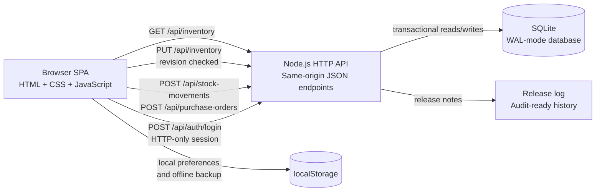
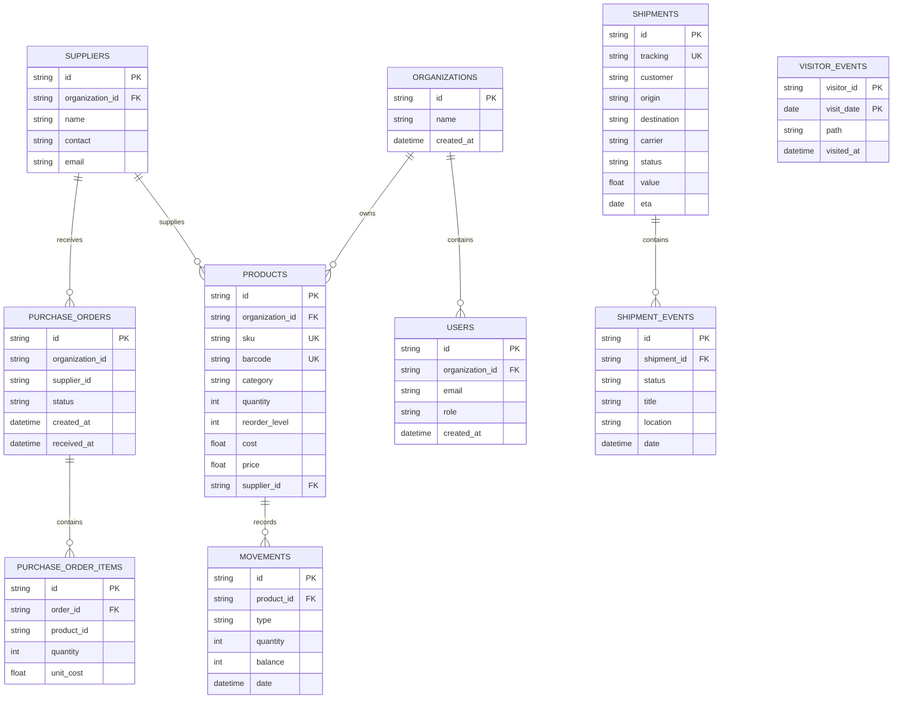

# InvenTrack Architecture

InvenTrack is a deliberately small full-stack application that demonstrates how an operational inventory system can be designed without hiding the important data flows behind a framework.

## System overview

The browser owns the interactive workspace and renders the dashboard, inventory catalogue, reorder plan, analytics globe, logistics center, and assistant. The Node.js server provides a same-origin JSON API and serves only the approved public files. SQLite is the source of truth for shared inventory data.

## Request and save flow

1. The browser requests `GET /api/inventory` when the page opens.
2. The server returns a revision number and the related collections: suppliers, products, movements, sales regions, shipments, shipment events, and purchase orders.
3. When `AUTH_REQUIRED=true`, the browser signs in through `/api/auth/login` and sends the resulting HTTP-only session cookie with API requests.
4. Catalogue and logistics edits update the in-memory workspace and send a revision-checked snapshot. The server rejects direct quantity edits in this path and retains existing movement records.
5. Stock-in, stock-out, and exact-quantity adjustments use `POST /api/stock-movements`. The server checks the organization and role, validates the quantity, updates stock, and appends one movement in a SQLite transaction.
6. The reorder plan creates supplier-grouped orders through `POST /api/purchase-orders`. Receiving an order through its `/receive` endpoint adds all ordered units and their audit movements atomically; an order cannot be received twice.
7. The server returns the new inventory snapshot and revision so the browser can refresh its workspace.

## Data relationships

## Backend safeguards

- SQLite foreign keys, `CHECK` constraints, unique SKUs, organization-scoped unique barcodes, and unique tracking IDs.
- WAL mode and a busy timeout for safer local concurrent reads and writes.
- Revision-based conflict protection for two browser sessions editing the same workspace.
- Optional scrypt password hashing, expiring HTTP-only sessions, server-side role checks, and organization-scoped business records when authentication is enabled.
- Full validation before a transaction is committed; invalid payloads roll back completely.
- Dedicated stock and purchase-order transactions keep quantities, receipts, and audit movements consistent. Regular snapshot saves retain existing movement records.
- Same-origin protection for writes and a static-file allowlist that never exposes the database or server source.
- HTML escaping at the rendering boundary for user-entered names, notes, suppliers, routes, and shipment events.
- Visitor analytics stores a random browser visitor ID with a daily uniqueness key; IP addresses, cookies beyond the local ID, and personal data are not collected.

## Frontend modules

| Module | Responsibility |
| --- | --- |
| Dashboard | Stock health, value, margin, categories, and urgent alerts |
| Products | Searchable catalogue, SKU validation, pricing, and supplier links |
| Reorder plan | Suggested quantities, procurement budget, supplier purchase orders, and receiving |
| Stock movements | Server-validated stock-in, stock-out, and adjustment ledger with barcode lookup |
| Suppliers | Partner records and contact links |
| Shipping & tracking | Shipment KPIs, route view, event timeline, ETA, and status progression |
| Admin insights | Sales-region globe, market value, supplier contribution, risk, and visitor pulse |
| Assistant | Local, data-aware answers without sending inventory data to an external AI service |

## Visual intelligence layer

- The distribution view renders an actual WebGL sphere mesh with a local equirectangular Earth texture, depth-tested lighting, pointer rotation/tilt, scroll zoom, and reset controls. It does not depend on a flat globe image or a third-party rendering library.
- A transparent SVG layer keeps country labels, sales-territory markers, curved shipment routes, route arrows, status colours, and accessible region selection crisp above the 3D model.
- Product cards use curated catalogue thumbnails and expose on-hand units, market value, margin rate, supplier, and stock status together.
- Supplier cards use partner portraits and calculate each partner's linked product lines, market-value share, route activity, and low-stock exposure from the current snapshot.

## Deployment boundary

The local Node.js + SQLite server is the complete academic demonstration. A hosted portfolio demo can run as a static snapshot using the browser's seeded fallback data. A commercial multi-tenant release should move the API to a managed Node-compatible host, migrate SQLite to PostgreSQL, add authentication and organization isolation, and configure backups before accepting customer data.

## Design decisions

- **No framework dependency:** the project keeps the request/response and rendering lifecycle visible for an MCA evaluation.
- **One snapshot save:** the compact data model makes rollback and conflict handling easy to explain during a viva.
- **Progressive enhancement:** the UI remains demonstrable from seeded browser data when the local API is unavailable, while connected sessions persist to SQLite.
- **Operational language:** every screen describes the decision a user can make next rather than presenting decorative metrics without context.
