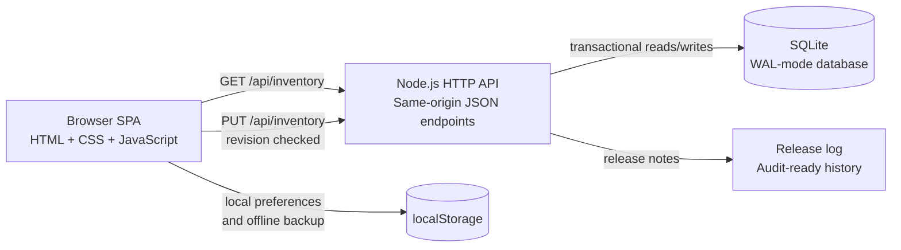
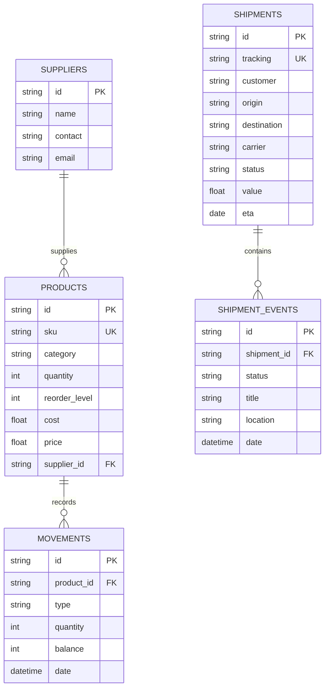

# InvenTrack Architecture

InvenTrack is a deliberately small full-stack application that demonstrates how an operational inventory system can be designed without hiding the important data flows behind a framework.

## System overview

The browser owns the interactive workspace and renders the dashboard, inventory catalogue, reorder plan, analytics globe, logistics center, and assistant. The Node.js server provides a same-origin JSON API and serves only the approved public files. SQLite is the source of truth for shared inventory data.

## Request and save flow

1. The browser requests `GET /api/inventory` when the page opens.
2. The server returns a revision number and the related collections: suppliers, products, movements, sales regions, shipments, and shipment events.
3. A user action updates the in-memory workspace immediately so the interface stays responsive.
4. The browser sends the complete snapshot with the revision it last loaded.
5. The server rejects stale revisions with `409 Conflict`, validates IDs and business values, then replaces the snapshot inside one SQLite transaction.
6. The server returns the new revision; the browser marks the database as synced and records the confirmation in the local activity log.

## Data relationships

## Backend safeguards

- SQLite foreign keys, `CHECK` constraints, unique SKUs, and unique tracking IDs.
- WAL mode and a busy timeout for safer local concurrent reads and writes.
- Revision-based conflict protection for two browser sessions editing the same workspace.
- Full validation before a transaction is committed; invalid payloads roll back completely.
- Same-origin protection for writes and a static-file allowlist that never exposes the database or server source.
- HTML escaping at the rendering boundary for user-entered names, notes, suppliers, routes, and shipment events.

## Frontend modules

| Module | Responsibility |
| --- | --- |
| Dashboard | Stock health, value, margin, categories, and urgent alerts |
| Products | Searchable catalogue, SKU validation, pricing, and supplier links |
| Reorder plan | Suggested quantities and procurement budget |
| Stock movements | Auditable stock-in, stock-out, and adjustment ledger |
| Suppliers | Partner records and contact links |
| Shipping & tracking | Shipment KPIs, route view, event timeline, ETA, and status progression |
| Admin insights | Sales-region globe, market value, supplier contribution, and risk |
| Assistant | Local, data-aware answers without sending inventory data to an external AI service |

## Visual intelligence layer

- The distribution view renders an actual WebGL sphere mesh with a local equirectangular Earth texture, depth-tested lighting, pointer rotation/tilt, scroll zoom, and reset controls. It does not depend on a flat globe image or a third-party rendering library.
- A transparent SVG layer keeps country labels, sales-territory markers, curved shipment routes, route arrows, status colours, and accessible region selection crisp above the 3D model.
- Product cards use curated catalogue thumbnails and expose on-hand units, market value, margin rate, supplier, and stock status together.
- Supplier cards use partner portraits and calculate each partner's linked product lines, market-value share, route activity, and low-stock exposure from the current snapshot.

## Deployment boundary

The local Node.js + SQLite server is the complete academic demonstration. A hosted portfolio demo can run as a static snapshot using the browser's seeded fallback data. A commercial multi-tenant release should move the API to a managed Node-compatible host, migrate SQLite to PostgreSQL, add authentication and organization isolation, and configure backups before accepting customer data.

## Design decisions

- **No framework dependency:** the project keeps the request/response and rendering lifecycle visible for an MCA evaluation.
- **One snapshot save:** the compact data model makes rollback and conflict handling easy to explain during a viva.
- **Progressive enhancement:** the UI remains demonstrable from seeded browser data when the local API is unavailable, while connected sessions persist to SQLite.
- **Operational language:** every screen describes the decision a user can make next rather than presenting decorative metrics without context.
